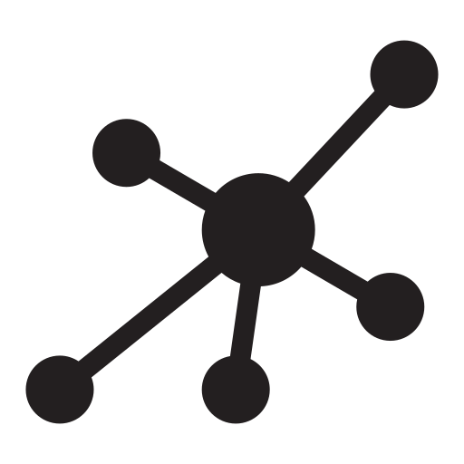

  
    <h1 align="center">💻 Dots 📝</h1>
  
A feature-rich blog application that comes with an intuitive admin dashboard.

- **Demo site:** [dots-the-chaos.fly.dev](https://dots-the-chaos.fly.dev/).
- **Documentation:** [dots-the-chaos.vercel.app](https://dots-the-chaos.vercel.app/).
- **Frontend:** React, Javascript, Tailwind CSS with Vite.
- **Database:** MongoDB.
- **Authentication:** Google OAuth.
- **Deployment:** Fly.io.

## 1. Getting Started

Copy `.env.example` to `.env` and fill in the environment variables.

- `VITE_FIREBASE*`: Firebase configuration. See [here]().
- `MONGO_URI`: MongoDB URI.
- `PORT`: Server Port
- `SECRET`: Secret key for JWT
- `CLOUDINARY*`: Cloudinary configuration. See [here](). 
